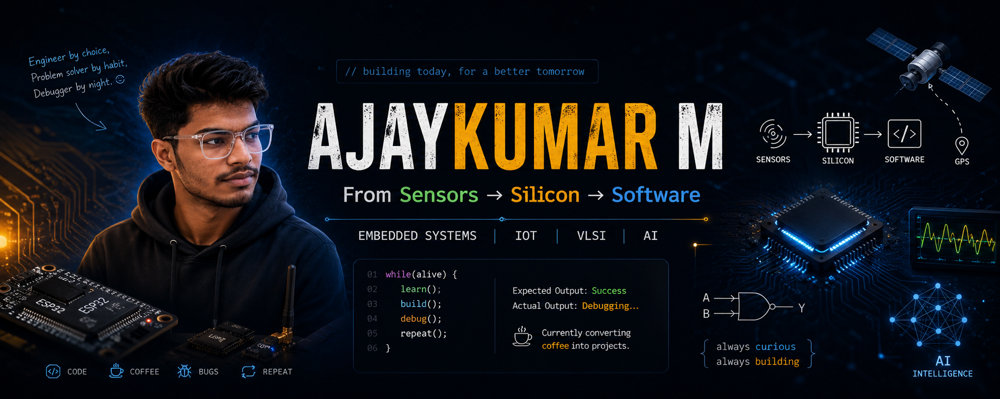

  

<h1 align="center">Ajaykumar M</h1>

  ECE (VLSI) Student | Embedded Systems & IoT Developer | Learning One Bug at a Time

---

About Me

I'm a final-year Electronics and Communication Engineering student specializing in VLSI at Kalasalingam Academy of Research and Education.

I enjoy building systems where hardware and software work together to solve real-world problems. Most of my work revolves around Embedded Systems, IoT, AI-assisted solutions, and intelligent automation.

While many people start with software and move towards hardware, I somehow ended up exploring both sides of the fence. Currently, I'm strongest in Embedded & IoT development and actively learning modern web technologies to build complete end-to-end solutions.

My goal is simple:

Build useful things. Learn continuously. Break fewer things than yesterday.

---

What I'm Working On

Embedded and IoT systems  
VLSI and digital design concepts  
AI-assisted engineering solutions  
Full-stack development (currently learning)  
Open-source and personal projects

---

Featured Projects

Cirkit_SASA  
An AI-powered platform focused on intelligent circuit design assistance and engineering productivity.

ESP32-Based Emergency Alert System  
Built using ESP32, LoRa, and GPS modules to provide reliable emergency communication during network failures.

Solar-Powered AI Insect Trap  
Smart agriculture project combining automation, sensor systems, and AI-assisted monitoring for sustainable farming.

Cognitive Autonomous Smart City Network  
A smart-city concept focused on congestion analysis, intelligent traffic management, and real-time monitoring.

Student Monitoring System  
Computer vision project using YOLO and MediaPipe for classroom and examination monitoring.

Wind Energy Forecasting  
Machine learning-based renewable energy prediction system using time-series data.

---

Technical Skills

Programming  
Python • C • C++ • Verilog

Embedded & IoT  
ESP32 • STM32 • Arduino • Raspberry Pi

Communication Protocols  
UART • I2C • SPI • LoRa • GPS

Software & Tools  
Git • GitHub • VS Code • Arduino IDE • STM32CubeIDE

Areas I Enjoy Exploring  
Embedded Systems • IoT • VLSI • AI Applications • Edge Intelligence • Hardware-Software Integration

---

Experience

Embedded & IoT Intern  
IMBED Software (MSME)

Worked on embedded and IoT-based applications, hardware interfacing, communication protocols, debugging, and system integration while gaining exposure to real-world engineering workflows.

---

Current Learning Journey

Full Stack Development  
Backend Architecture  
System Design  
Advanced Embedded Systems  
VLSI Design Flow

---

Fun Fact

Most people use GitHub to store code.

I occasionally use it to store bugs safely until I figure out what they are.

---

Connect

LinkedIn  
GitHub  
Open to internships, collaborations, and interesting engineering projects

---

From sensors and circuits to software and AI, I enjoy building systems that actually do something.
